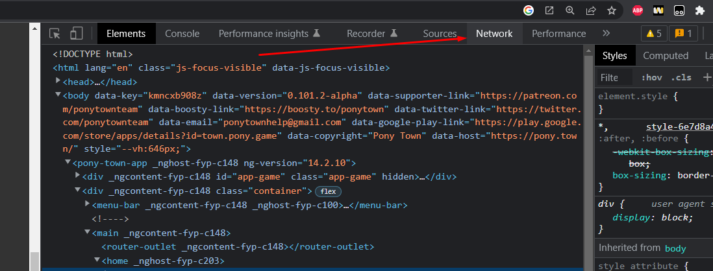
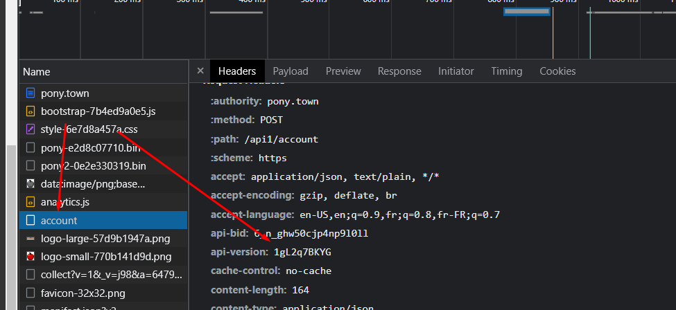

<div align="center">
    
    <p>A DotNet Standard C# <a href="https://pony.town/">PonyTown</a> API Wrapper</p>
</div>


## Getting Started
- Install the library from [Nuget](https://nuget.org/packages/DotNetPonies) or this repository

## Features

- [x] Get the servers list and status
- [ ] Get the account informations
- [x] Get the account ponies
- [ ] Pony data parsing
- [ ] OAuth2 support
- [ ] Friends list
- [ ] Simple bot implementation

## How to ?

- Get the servers list
```csharp
using DotNetPonies;

var client = new PonyTownClient();

// Resolve api version by searching in the pony town javascript code.
await client.ResolveApiVersion();

var status = await client.GetStatusAsync();

foreach (var server in status.Servers)
{
    Console.WriteLine($"{server.Id} - {server.Name} - {server.OnlineCount} players");
}
```

- Get all pony for an account
```csharp
using DotNetPonies;

var client = new PonyTownClient();

// Resolve api version by searching in the pony town javascript code.
await client.ResolveApiVersion();

// Login with your pony town account (cookie)
client.LoginWithCookie("<connect_sid>", "<remember_me>");

var ponies = await client.GetCharactersAsync("<account_id>", "<account_name>");

foreach (var pony in ponies)
{
    Console.WriteLine(pony.Name);
}
```

## Get api version manually

###  PonyTownException: Invalid game version

PonyTown API V2 is using a **api-version** header to validate a lot of request, in this case the api-version is not valid anymore for this build, it will be necessary to get it manually.

- First you need to go on [pony town](https://pony.town/) website and login.
- Open the chrome/firefox dev tool with F12.
- Go on the network tab

- Reload your page
- Go on the https://pony.town/api1/account ressource (or https://pony.town/api2/game/status if you have clicked on the server selector)

- Get the **api-version** header
- Create your client with this api version
```csharp
var client = new PonyTownClient("<api-version-here>");
```